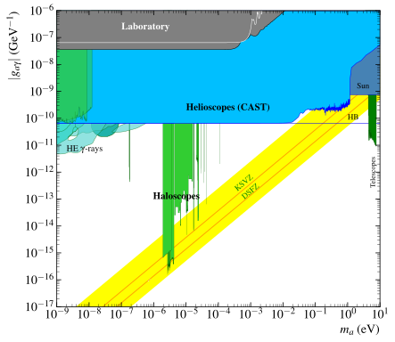
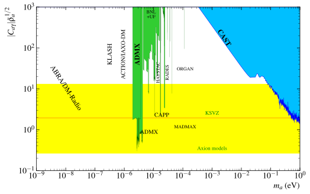

# iaxo-axion-limits
IAXO Axion Limits

The purpose of this website is to document a summer internship at the University of Zaragoza in the field of nuclear and particle physics, specifically within the axions group. During the internship, improvements were made to the code for plotting experiments, and an interactive application was created to label the graphs.

The graphs presented here are the results of the code, featuring the Axion Photon Coupling without its projections.

**Creator: Daniel Martinez Miravete**

# Basic Plot
---
[](https://github.com/DanielMartinezMiravete/Axion-limts/blob/main/Javatrain/plots/Labeled/AxionPhoton_large_panorama.svg)

## Basic plot without proyections

### [Download (.pdf)](https://github.com/DanielMartinezMiravete/Axion-limts/raw/main/Javatrain/plots/Labeled/AxionPhoton_large_panoramalabeled.pdf)
### [Download (.png)](https://github.com/DanielMartinezMiravete/Axion-limts/raw/main/Javatrain/plots/Labeled/AxionPhoton_large_panorama.png)
### [Download (.svg)](https://github.com/DanielMartinezMiravete/Axion-limts/raw/main/Javatrain/plots/Labeled/AxionPhoton_large_panorama.svg)

### &nbsp;

# Close up General Plot
---
[](https://github.com/DanielMartinezMiravete/Axion-limts/blob/main/Javatrain/plots/Labeled/AxionPhoton_panorama.svg)

## Close up General plot without proyections

### [Download (.pdf)](https://github.com/DanielMartinezMiravete/Axion-limts/raw/main/Javatrain/plots/Labeled/AxionPhoton_panoramalabeled.pdf)
### [Download (.png)](https://github.com/DanielMartinezMiravete/Axion-limts/raw/main/Javatrain/plots/Labeled/AxionPhoton_panorama.png)
### [Download (.svg)](https://github.com/DanielMartinezMiravete/Axion-limts/raw/main/Javatrain/plots/Labeled/AxionPhoton_panorama.svg)

### &nbsp;

# Close up Helioscopes Plot
---
[](https://github.com/DanielMartinezMiravete/Axion-limts/blob/main/Javatrain/plots/Labeled/AxionPhoton_helioscopes.svg)

## Close up Helioscopes plot without proyections

### [Download (.pdf)](https://github.com/DanielMartinezMiravete/Axion-limts/raw/main/Javatrain/plots/Labeled/AxionPhoton_helioscopeslabeled.pdf)
### [Download (.png)](https://github.com/DanielMartinezMiravete/Axion-limts/raw/main/Javatrain/plots/Labeled/AxionPhoton_helioscopes.png)
### [Download (.svg)](https://github.com/DanielMartinezMiravete/Axion-limts/raw/main/Javatrain/plots/Labeled/AxionPhoton_helioscopes.svg)

### &nbsp;
# Close up Halocopes Plot
---
[](https://github.com/DanielMartinezMiravete/Axion-limts/blob/main/Javatrain/plots/Labeled/AxionPhoton_haloscopes.svg)

## Close up Haloscopes plot without proyections

### [Download (.pdf)](https://github.com/DanielMartinezMiravete/Axion-limts/raw/main/Javatrain/plots/Labeled/AxionPhoton_haloscopeslabeled.pdf)
### [Download (.png)](https://github.com/DanielMartinezMiravete/Axion-limts/raw/main/Javatrain/plots/Labeled/AxionPhoton_haloscopes.png)
### [Download (.svg)](https://github.com/DanielMartinezMiravete/Axion-limts/raw/main/Javatrain/plots/Labeled/AxionPhoton_haloscopes.svg)

### &nbsp;

---

To recreate these images, we need to execute the Python program called "PlotAxionPhoton.py" as follows:
```
python3 PlotAxionPhoton.py    #To plot all the plots from Axion Photon 
```
This will plot all types of graphs listed without their projections. To include the projections, we should modify the "Projections" parameter in PlotAxionPhoton.py and set it to True.


These graphs are generated directly without labels since we have a web application capable of adding them interactively.

([Label's APP](http://htmlpreview.github.io/?https://github.com/DanielMartinezMiravete/Axion-limts/blob/main/Javatrain/svg/index.html))

This is only a preview of the app. To interact with it, you must download the repository. The app is located in the 'Java' folder, and you will also find another folder called 'plot' where the different plots are stored to verify the correct functioning of the app.

This application is only capable of modifying SVG files, which are generated automatically along with the PDFs when running the Python script. Instructions for the webpage are provided within the webpage itself.

