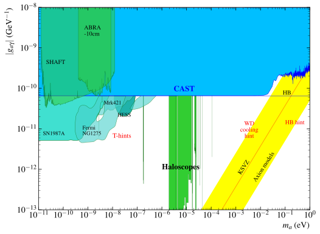

# iaxo-axion-limits
IAXO Axion Limits

The purpose of this web is to make the memory of a summer internships at the university of Zaragoza in the area of nuclear and particle physics.Specifically the axions group, making improvements in the code for graphing the experiments, and the creation of an interactive application to label the graphs.

Here There are a the graphs made by de code, I only recreate the Axion Photon Coupling without its proyections:

# Basic Plot
---
[](https://github.com/DanielMartinezMiravete/Axion-limts/blob/main/Javatrain/plots/Labeled/AxionPhoton_large_panorama.svg)

## Basic plot without proyections

### [Download (.pdf)](https://github.com/DanielMartinezMiravete/Axion-limts/raw/main/Javatrain/plots/Labeled/AxionPhoton_large_panoramalabeled.pdf)
### [Download (.png)](https://github.com/DanielMartinezMiravete/Axion-limts/raw/main/Javatrain/plots/Labeled/AxionPhoton_large_panorama.png)
### [Download (.svg)](https://github.com/DanielMartinezMiravete/Axion-limts/raw/main/Javatrain/plots/Labeled/AxionPhoton_large_panorama.svg)

### &nbsp;

# Close up General Plot
---
[](https://github.com/DanielMartinezMiravete/Axion-limts/blob/main/Javatrain/plots/Labeled/AxionPhoton_panorama.svg)

## Close up General plot without proyections

### [Download (.pdf)](https://github.com/DanielMartinezMiravete/Axion-limts/raw/main/Javatrain/plots/Labeled/AxionPhoton_panoramalabeled.pdf)
### [Download (.png)](https://github.com/DanielMartinezMiravete/Axion-limts/raw/main/Javatrain/plots/Labeled/AxionPhoton_panorama.png)
### [Download (.svg)](https://github.com/DanielMartinezMiravete/Axion-limts/raw/main/Javatrain/plots/Labeled/AxionPhoton_panorama.svg)

### &nbsp;

# Close up Helioscopes Plot
---
[](https://github.com/DanielMartinezMiravete/Axion-limts/blob/main/Javatrain/plots/Labeled/AxionPhoton_helioscopes.svg)

## Close up Helioscopes plot without proyections

### [Download (.pdf)](https://github.com/DanielMartinezMiravete/Axion-limts/raw/main/Javatrain/plots/Labeled/AxionPhoton_helioscopeslabeled.pdf)
### [Download (.png)](https://github.com/DanielMartinezMiravete/Axion-limts/raw/main/Javatrain/plots/Labeled/AxionPhoton_helioscopes.png)
### [Download (.svg)](https://github.com/DanielMartinezMiravete/Axion-limts/raw/main/Javatrain/plots/Labeled/AxionPhoton_helioscopes.svg)

### &nbsp;
# Close up Halocopes Plot
---
[](https://github.com/DanielMartinezMiravete/Axion-limts/blob/main/Javatrain/plots/Labeled/AxionPhoton_haloscopes.svg)

## Close up Haloscopes plot without proyections

### [Download (.pdf)](https://github.com/DanielMartinezMiravete/Axion-limts/raw/main/Javatrain/plots/Labeled/AxionPhoton_haloscopeslabeled.pdf)
### [Download (.png)](https://github.com/DanielMartinezMiravete/Axion-limts/raw/main/Javatrain/plots/Labeled/AxionPhoton_haloscopes.png)
### [Download (.svg)](https://github.com/DanielMartinezMiravete/Axion-limts/raw/main/Javatrain/plots/Labeled/AxionPhoton_haloscopes.svg)

### &nbsp;

---

Para recreaer estas imagenes necesitamos ejecutar en python el programa llamado PlotAxionPhoton.py 
```
python3 PlotAxionPhoton.py    #To plot all the plots from Axion Photon 
```
Este ploteará todos los tipos de graficas listadas sin sus proyecciones para ello debemos modificar en PlotAxionPhoton.py el parametro "Proyections" y darle el valor Verdadero
Estas graficas se generaran sin etiquetas ya que tenemos una aplicacion web capaz de ponerselas de maner interactiva.

[Nombre del Enlace]([URL de tu página web](http://htmlpreview.github.io/?https://github.com/DanielMartinezMiravete/Axion-limts/blob/main/Javatrain/svg/index.html))


Esta apliaccion es unicamente capaz de modificar SVG los cuales se generan automaticamente juntos con los pdf's al ejecutar el script de python, las instrucciones de la pagina web estan en ella misma.


