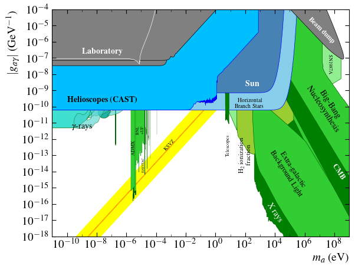

# iaxo-axion-limits
IAXO Axion Limits

To regenerate plots use:

```
python3 Plot_Axion_Photon.py    #To plot all the plots from Axion Photon 
python3 Plot_Axion_Electron.py  #To plot Axion Electron

```


TODO: Create a proper documentation here. Adding image gallery examples.
The purpose of this web is to make the memory of a summer internships at the university of Zaragoza in the area of nuclear and particle physics.Specifically the axions group, making improvements in the code for graphing the experiments, and the creation of an interactive application to label the graphs.

Here There are a the graphs made by de code, I only recreate the Axion Photon Coupling without its proyections:

# Basic Plot

Here we have the basic plot of the whole panorama of Axion Photon experiments.

<div style="display: flex; flex-direction: row; align-items: center;">
  <div style="flex: 1; text-align: left;">
    ## Descargar Formatos

    A continuación se encuentran los enlaces para descargar diferentes formatos:
    - [Plots (pdf)](plots/AxionPhoton_large_panoramalabeled.pdf)
    - [Plot with proyections (pdf)](plots/AxionPhoton_large_panoramalabeled.pdf)
  </div>
  
  <div style="flex: 1; text-align: right;">
    
  </div>
</div>


TODO: Add few parameters to avoid commenting/discommenting code, enable batch mode, plot saving, etc.

TODO: It is possible to select the image output format?
# Axion_limits
